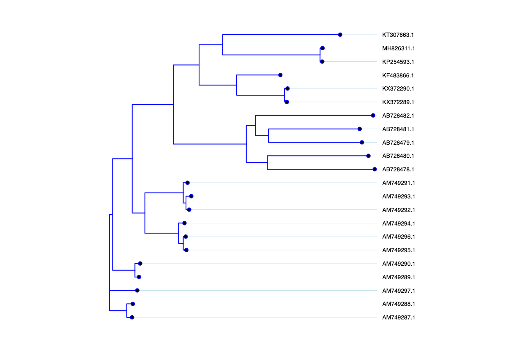
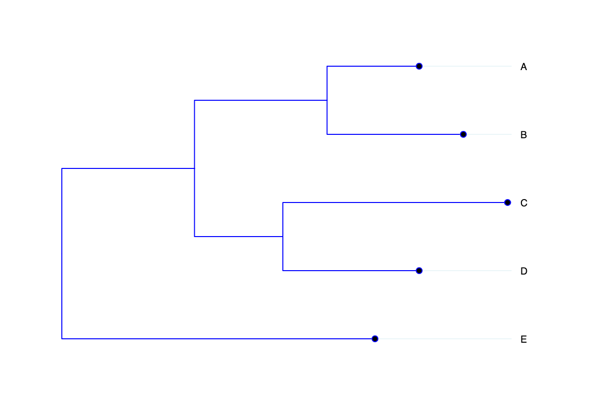

# NEWICK PARSER
## Visualize Newick Tree Format


## Usage
```javascript
const str =
"(((A:0.2, B:0.3):0.3,(C:0.5, D:0.3):0.2):0.3, E:0.7):1.0;";
const tree = new Tree("#tree");
tree.init(str);
```
